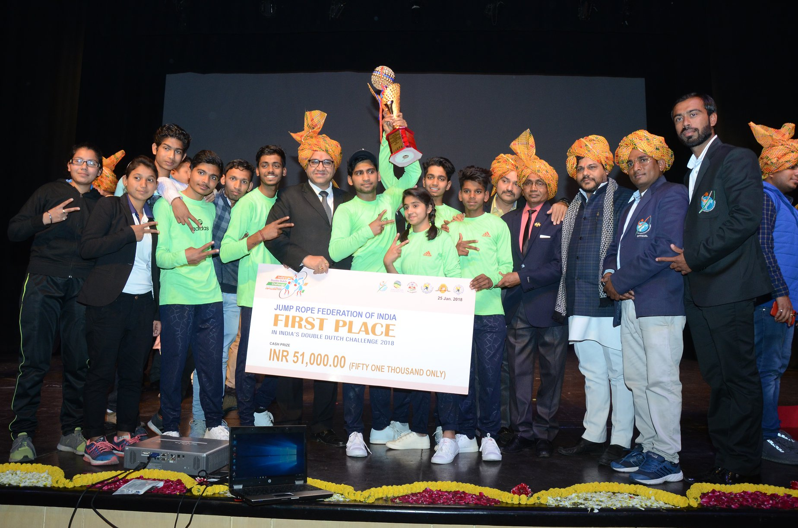

-----

## One Key Rope Skipper

***Name***

Saumya Agrawal

***Personal Profile***

She is Saumya Agrawal, an 18 years old jumper. She lives in Ujjain, a small city in Madhya Pradesh, India. She is currently studying in Kamala Nehru College, Delhi university and pursuing philosophy honours with psychology. She is a sports lover and is passionate about jump rope. Other than that she poses many hobbies like playing guitar, listening to music, drawing and writing. She is a super active person and loves to be busy. While enthusiastically participating in all the activities, she never ignored her studies. This helped her learn better time management skills and gave her no time to overthink or think negatively. She is a spiritual person and believes in karma and hard work. She is also optimistic towards life and always tries to learn from her surroundings. She always looks forward to the opportunities and never turns her back on the challenges. She is a nature lover and wandering in nature relaxes her. Explore new beats and tunes on guitar and Groovepad (it’s an app) is her favourite pastime. She is a keen observer and likes to help people with their problems and spread smiles.

***Best Record:***

ENDURANCE (488)

***Past Competition / Performance Photos***

<!-- ***Past Competition / Performance Videos*** -->

<!-- * [**Past Competition / Performance Videos ----- 1**](../../videos/members/member_2-1.mov) -->
<!-- * [**Past Competition / Performance Videos ----- 2**](../../videos/members/member_2-2.mp4)
* [**Past Competition / Performance Videos ----- 3**](../../videos/members/member_2-3.mp4) -->
